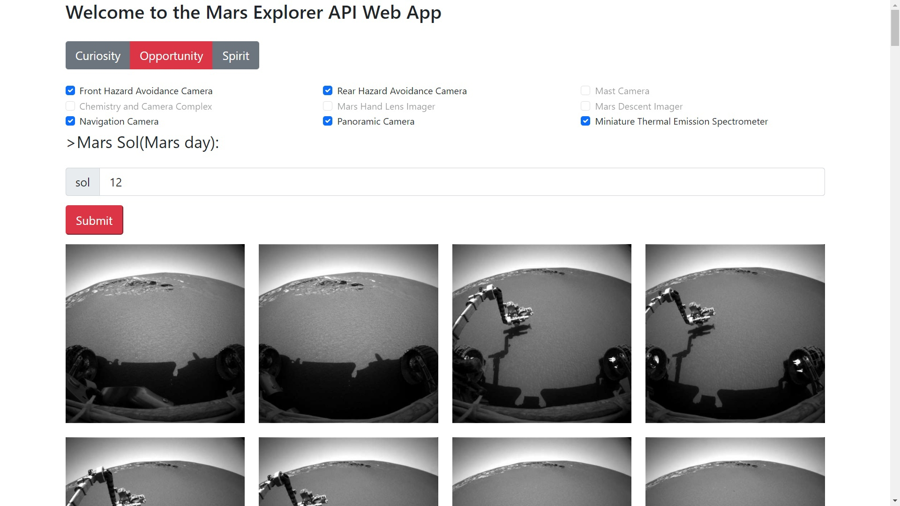

## Mars Explorer Api-Client
***
This is an application that allows you to upload the real Mars photos made by 3 NASA Mars Rovers: Curiosity, Opportunity and Spirit.
The API is supported by [NASA] https://api.nasa.gov/

Mars rovers Opportunity and Curiosity were launched back in 2003. Unfortunately now connection with them is lost.

However, Curiosity, which was launched in 2011, is still working.
### Screenshot

## Technologies
***
A list of technologies used within the project:
* [jdk](https://www.oracle.com/java/technologies/javase/jdk15-archive-downloads.html): Version 16
* [Spring Boot](https://spring.io/projects/spring-boot): Version 2.6.2
* [Thymeleaf](https://www.thymeleaf.org/): Version 3.0.4
* [Maven](https://maven.apache.org/): Version 3.8.4

